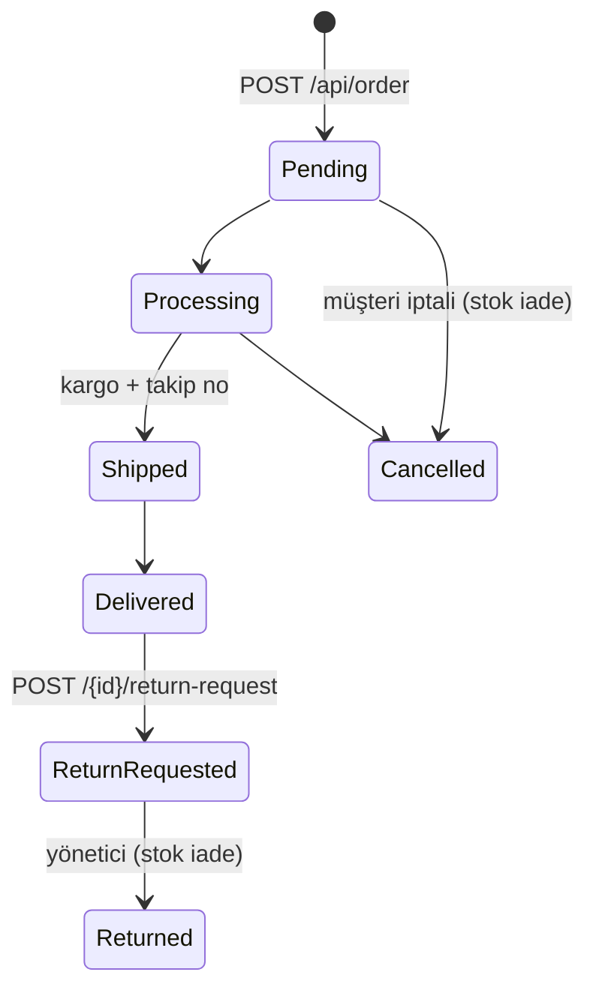

# E-Ticaret Backend — .NET

[](https://dotnet.microsoft.com/)
[](https://learn.microsoft.com/aspnet/core)
[](https://www.postgresql.org/)
[](docs/API_CONTRACT.md)

**PazarKapısı** demo e-ticaret sitesinin ASP.NET Core backend'i. Ürün kataloğu, sepet, ödeme ve sipariş akışı, kullanıcı hesabı, bildirimler, yardım merkezi ve yönetim paneli için REST API sunar.

Bu proje [**backend-spring**](https://github.com/MihrimatriX/backend-spring) ile **ikizdir**: iki backend ayrı kod tabanlarıdır ama
[`docs/API_CONTRACT.md`](docs/API_CONTRACT.md)'deki **aynı HTTP sözleşmesini** uygular. Vitrin
([temp-shop-net](https://github.com/MihrimatriX/temp-shop-net)) yalnızca API adresini değiştirerek hangisine bağlanacağını seçer.

<p align="center">
  
  <br><em>temp-shop-net vitrini bu backend'e bağlı (<code>NEXT_PUBLIC_API_URL=http://localhost:5000</code>)</em>
</p>

---

## İçindekiler

- [İkiz backend yaklaşımı](#ikiz-backend-yaklaşımı)
- [Hızlı başlangıç](#hızlı-başlangıç)
- [Demo hesapları](#demo-hesapları)
- [API'ye genel bakış](#apiye-genel-bakış)
- [Cevap biçimi ve hatalar](#cevap-biçimi-ve-hatalar)
- [İş kuralları](#iş-kuralları)
- [Yapılandırma](#yapılandırma)
- [Test](#test)
- [Proje yapısı](#proje-yapısı)
- [İzleme](#izleme)
- [Sorun giderme](#sorun-giderme)

---

## İkiz backend yaklaşımı

| | backend-dotnet (bu repo) | backend-spring |
|---|---|---|
| Çatı | ASP.NET Core 9 · C# | Spring Boot 3.4 · Java 17 |
| Varsayılan adres | `http://localhost:5000` | `http://localhost:8081` |
| Geliştirme veritabanı | SQLite (`ecommerce.db`) | H2 (bellek içi) |
| Üretim veritabanı | PostgreSQL + EF Core migration | PostgreSQL + Flyway |
| Mesajlaşma | MassTransit (InMemory / RabbitMQ) + outbox | RabbitMQ (opsiyonel) |
| Swagger | `/swagger` | `/swagger-ui.html` |
| **HTTP sözleşmesi** | **aynı** — [`docs/API_CONTRACT.md`](docs/API_CONTRACT.md) | **aynı** |

Aynı olan her şey: rotalar, istek/cevap alan adları, `{ success, message, data, errorCode, … }` zarfı, HTTP durum kodları,
hata kodları ve mesajları, JWT claim'leri (`sub`, `email`, `role`), sayfalama, tarih biçimi (UTC `Z`), kargo/indirim/stok
kuralları ve demo hesapları. Bunu iki taraf da aynı testle doğrular:

<p align="center"></p>

---

## Hızlı başlangıç

### Seçenek 1 — Docker Compose (PostgreSQL + Redis + RabbitMQ + API)

```bash
docker compose up --build -d
docker exec dotnet-backend dotnet EcommerceBackend.dll seed-demo   # zengin demo katalog (opsiyonel)
```

| Servis | Adres |
|---|---|
| API | http://localhost:5000 |
| Swagger UI | http://localhost:5000/swagger |
| Sağlık | http://localhost:5000/api/health · http://localhost:5000/health-ui |
| RabbitMQ yönetim | http://localhost:15672 (ecommerce / ecommerce_dev) |

Windows/PowerShell için: `./scripts/docker-up.ps1` (kapatma `./scripts/docker-down.ps1`).

### Seçenek 2 — Yerelde (SQLite, dış servis gerekmez)

Gereken: .NET 9 SDK (`global.json` 9.x'e sabitler).

```bash
dotnet run                      # http://localhost:5000
dotnet run -- seed-demo         # demo katalog + yorumlar yükle ve çık
```

Geliştirme profili `ecommerce.db` SQLite dosyasını kullanır; şema açılışta oluşturulur ve eski dosyalara yeni
tablo/kolonlar otomatik eklenir. Redis yoksa katalog önbelleği devre dışı kalır, RabbitMQ yerine bellek içi taşıyıcı kullanılır.

<p align="center"></p>

Vitrini bu backend'e bağlamak için temp-shop-net'te (varsayılan zaten budur):

```bash
NEXT_PUBLIC_API_URL=http://localhost:5000 npm run dev
```

---

## Demo hesapları

Başlangıçta idempotent olarak oluşturulur (e-posta varsa dokunulmaz).

| E-posta | Şifre | Rol |
|---|---|---|
| admin@example.com | admin123 | Admin |
| manager@shop.demo | Manager123! | Admin |
| user1@example.com … user4@example.com | user123 | User |
| support@shop.demo | Support123! | User |
| demo.buyer@shop.local | Buyer123! | User |
| staff@shop.demo | Staff123! | User |

Admin rolü `Auth:AdminEmails` listesinden gelir. Üretimde şifreleri ve listeyi değiştirin.

---

## API'ye genel bakış

Tüm uçlar `/api` altındadır. Ayrıntılar, alan adları ve hata kodları için [**API sözleşmesi**](docs/API_CONTRACT.md).

| Modül | Örnek uçlar | Yetki |
|---|---|---|
| Kimlik | `POST /api/auth/register` · `login` · `logout` | Anonim |
| Katalog | `GET /api/product?searchTerm=&categoryId=&sortBy=UnitPrice&sortOrder=desc&pageNumber=1&pageSize=12` · `/api/product/{id}` · `/featured` · `/discounted` · `/api/category` · `/api/subcategory` · `/api/campaign/active` | Anonim (yazma: Admin) |
| Yorumlar | `GET /api/review/product/{id}` · `/summary` · `POST /api/review` | Okuma anonim, yazma kullanıcı |
| Sepet | `GET /api/cart` · `POST /add` · `PUT /update` · `DELETE /remove/{productId}` · `GET /count` | Kullanıcı |
| Sipariş | `POST /api/order` (opsiyonel `Idempotency-Key`) · `GET /api/order` · `PUT /{id}/cancel` · `POST /{id}/return-request` | Kullanıcı |
| Hesap | `/api/address` · `/api/paymentmethod` · `/api/favorite` · `/api/notification` · `/api/security` · `/api/settings` | Kullanıcı |
| Yardım | `GET /api/helpsupport/faqs` · `/articles` · `POST /contact` · `/tickets` | Karışık |
| Yönetim | `GET /api/order/admin` · `PUT /api/order/{id}/status` · `GET /api/review/admin` · `GET /api/helpsupport/tickets/admin` | Admin |
| Durum | `GET /api/test/hello` · `/api/health` · `/api/metrics/custom` · `/api/metrics/prometheus` | Anonim |

<table>
<tr>
<td></td>
<td></td>
</tr>
</table>

---

## Cevap biçimi ve hatalar

Başarılı cevaplar `data` taşır; hatalar aynı zarfta `errorCode` ve `traceId` (= `X-Correlation-Id` başlığı) ile döner.

<table>
<tr>
<td></td>
<td></td>
</tr>
</table>

| HTTP | `errorCode` örnekleri |
|---|---|
| 400 | `VALIDATION_ERROR` (alan bazlı `errors` ile), `BAD_REQUEST`, `CART_MISMATCH`, `CHECKOUT_FAILED`, `CANCEL_NOT_ALLOWED` … |
| 401 | `UNAUTHORIZED`, `INVALID_CREDENTIALS` |
| 403 | `FORBIDDEN` |
| 404 | `NOT_FOUND`, `PRODUCT_NOT_FOUND`, `ORDER_NOT_FOUND` … |
| 409 | `EMAIL_TAKEN`, `CONFLICT` |
| 429 | `RATE_LIMITED` |

**JWT:** HS256, 24 saat. Claim'ler `sub` (kullanıcı id), `email`, `role` (`Admin`/`User`), `jti`, `iss`, `aud`.
`POST /api/security/logout-all-devices` çağıran token hariç kullanıcının tüm token'larını geçersiz kılar.

---

## İş kuralları

- **Fiyat:** satış fiyatı = `unitPrice × (1 − discount/100)` (2 basamağa yuvarlanır). Sepet ve sipariş bu fiyatı kullanır.
- **Kargo:** ara toplam 150 TL altındaysa 34,99 TL, üstünde ücretsiz (`Checkout:*`).
- **Sipariş:** sepet ile ödeme özeti birebir eşleşmeli (`CART_MISMATCH`); stok tek transaction içinde düşülür; ödeme simülasyonu kartın son kullanma tarihini kontrol eder; aynı `Idempotency-Key` ile tekrar gönderilen istek aynı siparişi döndürür.
- **Kart verisi:** tam kart numarası ve CVV saklanmaz; yalnızca `**** **** **** 1234` biçimi tutulur.



Her durum değişikliği kullanıcıya bildirim olarak düşer. Geliştirmede `POST /api/order/{id}/demo/advance-fulfillment`
siparişi bir sonraki lojistik adımına taşır (`Checkout:DemoFulfillmentEnabled`).

---

## Yapılandırma

`appsettings.json` → `appsettings.{Environment}.json` → ortam değişkenleri (`Bölüm__Anahtar`).

| Ayar | Ortam değişkeni | Varsayılan |
|---|---|---|
| Ortam | `ASPNETCORE_ENVIRONMENT` | `Development` |
| Veritabanı | `ConnectionStrings__DefaultConnection`, `Database__Provider` (`Sqlite`/`Npgsql`) | Dev: `Data Source=ecommerce.db` |
| JWT anahtarı / issuer / audience / süre | `Jwt__Key`, `Jwt__Issuer`, `Jwt__Audience`, `Jwt__ExpirationInMinutes` | geliştirme anahtarı / `EcommerceBackend` / `EcommerceUsers` / `1440` |
| Yönetici e-postaları | `Auth__AdminEmails__0`, `__1` … | `admin@example.com`, `manager@shop.demo` |
| CORS origin'leri | `Cors__AllowedOrigins__0` … | `http://localhost:3000, :5173, :8080` |
| Hız limiti | `RateLimit__PermitPerMinute` | `300` (`0` = kapalı) |
| Kargo | `Checkout__FreeShippingThresholdTry`, `Checkout__StandardShippingFeeTry` | `150` / `34.99` |
| Demo lojistik | `Checkout__DemoFulfillmentEnabled` | Development: `true` |
| Redis | `Redis__ConnectionString` | `localhost:6379` |
| RabbitMQ | `RabbitMq__Transport` (`InMemory`/`RabbitMq`), `RabbitMq__Host` … | `InMemory` |

---

## Test

```bash
dotnet test                                            # entegrasyon testleri (Testcontainers → Docker gerekir)
node scripts/contract-smoke.mjs run http://localhost:5000 out-dotnet.json   # sözleşme testi (~200 kontrol)
node scripts/contract-smoke.mjs compare out-dotnet.json out-spring.json      # iki backend'i karşılaştır
```

Sözleşme testi kayıt → adres/kart → sepet → sipariş → iade → yorum → ayarlar → yönetim akışını gerçek HTTP ile yürütür;
beklenen durum kodunu, `data` varlığını ve tarih biçimini doğrular, her cevabın şeklini kaydeder.

---

## Proje yapısı

```
Application/        # DTO'lar, servisler (iş kuralları), seçenek sınıfları, entegrasyon olayları
Domain/Entities/    # EF Core varlıkları
Infrastructure/
├── Data/           # DbContext, seed, SQLite şema tamamlayıcı
├── Messaging/      # MassTransit tüketicileri + outbox
├── Middleware/     # Hata zarfı, korelasyon, güvenlik başlıkları, loglama
├── Repositories/
└── Web/            # Controller'lar
Migrations/         # EF Core (PostgreSQL)
tests/              # Entegrasyon testleri (Testcontainers)
docs/API_CONTRACT.md        # Ortak sözleşme (backend-spring ile aynı)
scripts/contract-smoke.mjs  # Sözleşme testi (backend-spring ile aynı)
```

---

## İzleme

- `/api/health` (bileşen bazlı), `/health-ui` (HealthChecks UI), `/health` (Docker healthcheck)
- `/api/metrics/prometheus` — Prometheus metinleri; `/api/metrics/custom` — özet sayaçlar
- Prometheus + Grafana ayarları: `monitoring/`
- Her istekte `X-Correlation-Id` üretilir/taşınır ve Serilog loglarında görünür.

---

## Sorun giderme

| Belirti | Çözüm |
|---|---|
| Vitrinde CORS hatası | Vitrin origin'ini `Cors:AllowedOrigins`'e ekleyin |
| `5000` portu dolu | `ASPNETCORE_URLS=http://localhost:5050 dotnet run` |
| Eski SQLite dosyasında hata | `ecommerce.db` dosyasını silip yeniden başlatın (şema yeniden oluşur) |
| 401 "Kimlik doğrulama gerekli." | Token süresi dolmuş veya `logout-all-devices` ile iptal edilmiş olabilir; tekrar giriş yapın |
| 429 `RATE_LIMITED` | `RateLimit:PermitPerMinute` değerini artırın veya `0` yapın |

## Lisans

MIT
